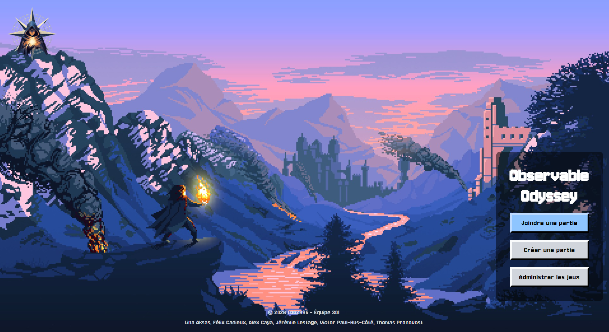
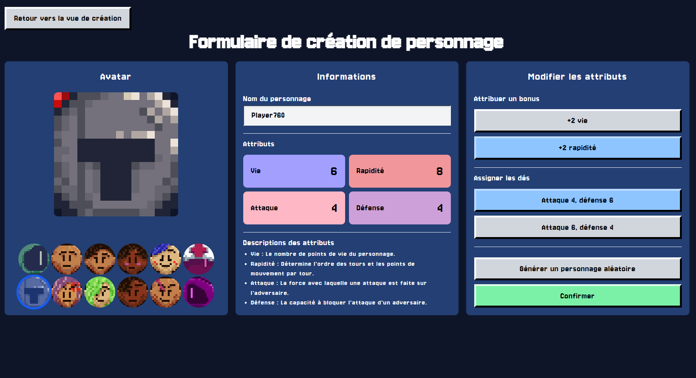
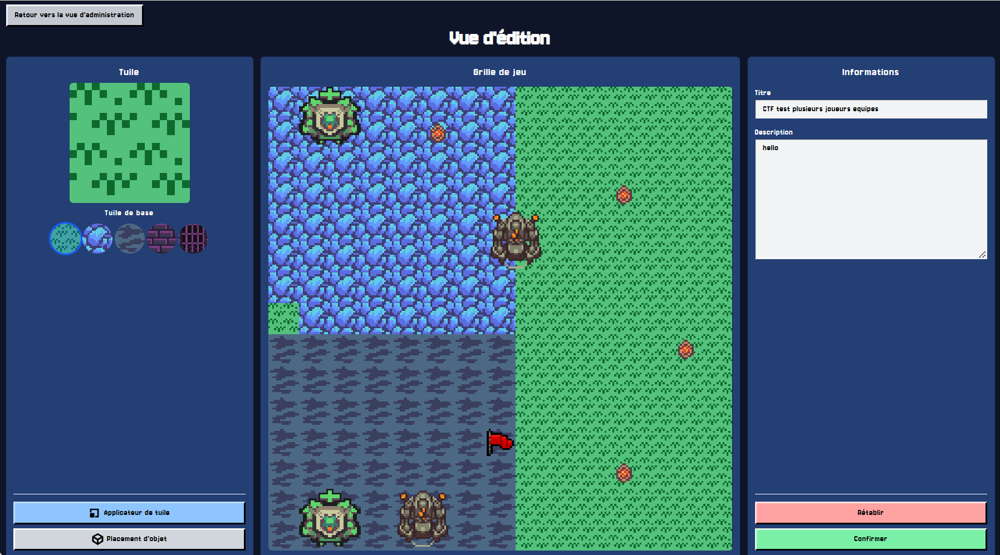
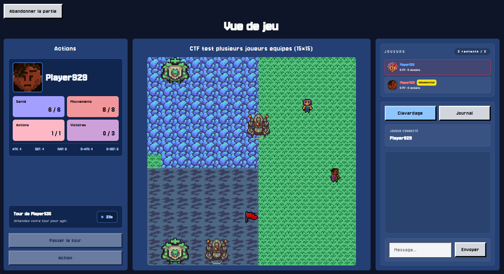

# Observable Odyssey

**Language: [Français](README.fr.md) | English**

Observable Odyssey is a turn-based multiplayer tactical game. The application combines an Angular client, an Express API, and Socket.IO communication to deliver a complete experience—from map creation and game setup to real-time battles and post-game statistics.

The project was built by a six-person team with a strong focus on separation of concerns, consistent game-state synchronization, and code quality.

## Preview

### Home page



### Character creation



### Map editor



### Live game



## Project overview

Players choose a character, configure their attributes, and join a lobby using a unique game code. Once the session begins, they explore a tile-based map, move according to terrain costs, interact with doors and sanctuaries, and face opponents through a turn-based combat system.

Two game modes are available:

- **Classic**: win the required number of battles to claim victory.
- **Capture the Flag (CTF)**: work with your team to retrieve the opposing flag and bring it back to your base.

## What makes this project interesting

- A complete web application split into a modern Angular client and a TypeScript server.
- Real-time multiplayer state synchronization with Socket.IO, including movement, turns, battles, chat, and game events.
- A visual editor for designing and validating playable maps of multiple sizes.
- Rich domain logic covering pathfinding, action validation, combat, CTF objectives, and game completion.
- Aggressive and defensive virtual players capable of participating in live matches.
- A quality-focused architecture supported by automated tests, code coverage, linting, OpenAPI documentation, and continuous integration.

## Key features

### Administration and map creation

- Create, edit, delete, and control the visibility of game maps.
- Select a game mode and grid size.
- Place terrain, walls, doors, starting positions, flags, and sanctuaries.
- Validate accessibility, required objects, and game-mode constraints before saving a map.

### Lobbies and game setup

- Create or join a multiplayer session using a unique code.
- Build a character by selecting an avatar, attributes, and bonus dice.
- Use a synchronized waiting room and real-time chat.
- Lock the lobby and add virtual players as the game organizer.
- Assign teams for Capture the Flag matches.

### Gameplay experience

- Move according to available movement points and terrain costs.
- Highlight reachable tiles and inspect map cells or other players.
- Interact with doors, sanctuaries, and the flag.
- Fight turn-based battles using offensive and defensive stances.
- Follow synchronized turn transitions, countdowns, chat messages, and event logs.
- Handle forfeits, disconnections, and game completion.
- Review player results and statistics on the end-game screen.

## Architecture

```text
.
├── client/   Angular single-page application and game interface
├── server/   Express API, Socket.IO server, and domain logic
├── common/   Shared interfaces, events, and constants
└── static/   Deployment documentation assets
```

The `common` directory serves as the contract between both applications. It centralizes game models and real-time events to preserve consistent typing from the browser to the server.

The server separates game management, gameplay rules, real-time communication, map validation, and virtual-player behavior. The client divides responsibilities across pages, UI components, domain services, Socket.IO services, and pathfinding utilities.

## Technology stack

| Area | Technologies |
| --- | --- |
| Frontend | Angular 21, TypeScript, RxJS, Tailwind CSS |
| Backend | Node.js, Express 5, TypeScript, TypeDI |
| Real-time communication | Socket.IO |
| Data | MongoDB, Mongoose |
| API | REST, Swagger / OpenAPI |
| Client testing | Jasmine, Karma |
| Server testing | Mocha, Chai, Sinon, Supertest, MongoDB Memory Server |
| Quality and delivery | ESLint, Prettier, NYC, GitLab CI |

## Getting started

### Prerequisites

- Node.js and npm
- An accessible MongoDB instance, or MongoDB Memory Server for the temporary database

### Installation

Both applications manage their dependencies separately:

```bash
cd client
npm ci

cd ../server
npm ci
```

### Server configuration

Before starting the server, define the following environment variables:

```env
DATABASE_CONNECTION_STRING=mongodb://localhost:27017/observable-odyssey
IN_MEMORY_DATABASE_CONNECTION_STRING=mongodb://localhost:27017/observable-odyssey-active
```

To automatically create a temporary MongoDB instance instead of providing the second connection:

```env
DATABASE_CONNECTION_STRING=mongodb://localhost:27017/observable-odyssey
USE_MONGO_MEMORY_SERVER=true
```

### Running locally

Start both applications in separate terminals:

```bash
cd server
npm start
```

```bash
cd client
npm start
```

The client is available at `http://localhost:4200`, while the server listens on `http://localhost:3000`. Interactive API documentation is available at `http://localhost:3000/api/docs`.

## Quality assurance and testing

Run these commands from the relevant subproject:

```bash
# Client
cd client
npm run lint
npm test
npm run coverage

# Server
cd ../server
npm run lint
npm test
npm run coverage
```

The repository includes client and server unit tests, HTTP route tests, and scenarios covering real-time game logic. The GitLab pipeline automates dependency installation, linting, and test execution.

## Additional documentation

- [CONTRIBUTING.md](CONTRIBUTING.md) — contribution guidelines and Git practices.
- [DEPLOYMENT.md](DEPLOYMENT.md) — deployment process and infrastructure configuration.
- [TESTS.md](TESTS.md) — testing instructions and coverage-report generation.

## Why this project matters

Observable Odyssey demonstrates the design of a web product that goes beyond a traditional CRUD application. It combines an interactive user experience, non-trivial game rules, and an event-driven backend that must maintain a consistent shared state through concurrent actions, turn transitions, and disconnections.

For a recruiter, the project highlights practical skills in frontend and backend architecture, real-time programming, domain modeling, pathfinding algorithms, automated testing, and collaborative software development.